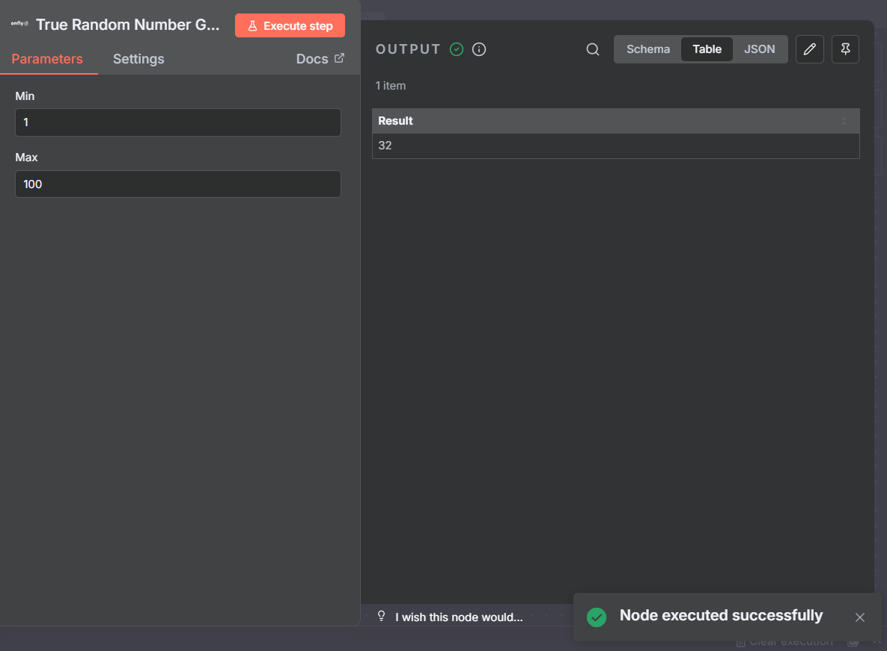
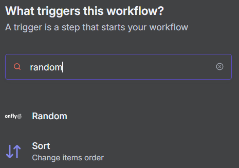
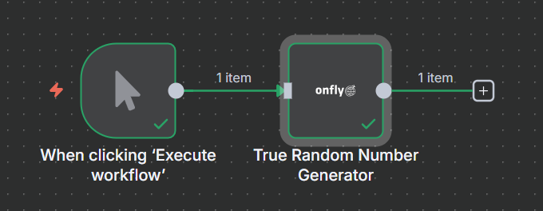

## Teste Técnico Onfly

Conector personalizado para a plataforma de automação n8n, desenvolvido em Node.js e TypeScript utilizando a API do [Ramdom.org](https://www.random.org/) para a resolução do teste técnico da Onfly



#### Tecnologias Utilizadas

  - [Node.js](https://nodejs.org/pt) + TypeScript na versão 22 (LTS)
  - [Docker](https://www.docker.com/) compose para subir o n8n + instância Postgres para o n8n
  
#### Etapas para executar o projeto

###### 1) Clonar repositório

  ```bash
   git clone https://github.com/renan-git/onfly.git
   ```

###### 2) Criar o arquivo .env
Para que o Docker consiga configurar corretamente o banco de dados PostgreSQL, crie um arquivo chamado .env na raiz do projeto e defina as variáveis abaixo:

``` bash 
POSTGRES_USER=user
POSTGRES_PASSWORD=password
POSTGRES_DB=n8n

POSTGRES_NON_ROOT_USER=user
POSTGRES_NON_ROOT_PASSWORD=password
```
- Substitua user e password por valores seguros
- Não altere POSTGRES_DB

###### 3) Instalar as Depêndencias e Realizar o Build
Execute os seguintes comandos:
``` bash 
cd custom/n8n-nodes-onfly-random
npm i
npm run build
```
###### 4) Inicializar o Docker

Retorne a pasta raiz do projeto:
``` bash 
cd ../..
```
Inicialize o container
``` bash 
docker compose up -d
```
O n8n estará disponível em seu navegador no endereço
```bash
 http://localhost:5678
 ```



